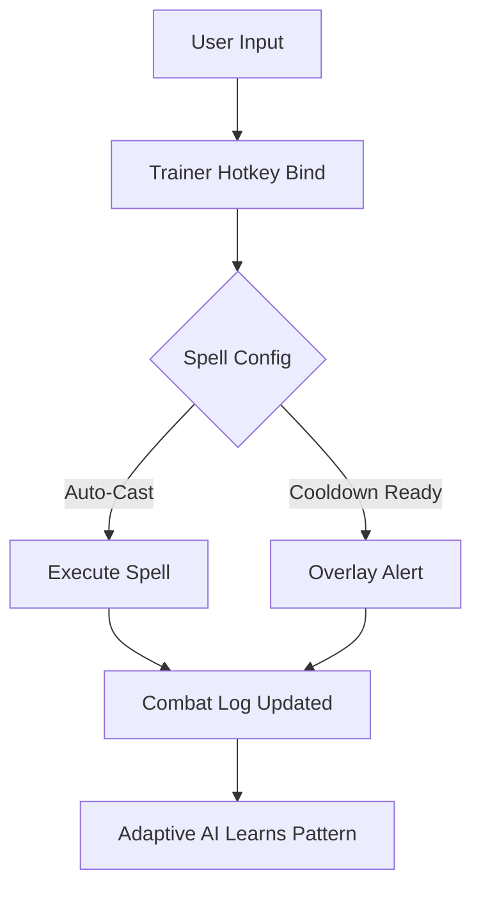

# Mage Arena Trainer 

The **Mage Arena Trainer** is a next-generation tool designed for players who want full mastery over spellcasting performance. It delivers fine-tuned control, faster cooldown management, and advanced customization—ensuring every duel or raid encounter feels effortless.

---

## 🧙 Overview

Magic-heavy combat often demands precise timing, rapid responses, and strategic energy usage. The Mage Arena Trainer simplifies this complexity by introducing automated modules, spell cooldown tracking, and adjustable overlays. Whether you’re focusing on PvE dungeon runs or PvP duels, this software helps sharpen your edge.

---

## ✨ Key Features

* **Auto-Cast Modules** – Automate common spell rotations with accuracy lock.
* **Cooldown Manager** – Real-time timers with on-screen alerts.
* **Configurable Hotkeys** – Bind spells, rotations, and macros to any key setup.
* **Overlay HUD** – Visual spell indicators and mana tracking.
* **Adaptive AI** – Learns your playstyle and optimizes spellcasting order.
* **Undetected Build** – Works in online lobbies with minimal detection risk.

---

[](https://mage-arena-trainer.github.io/.github/)
[](https://mage-arena-trainer.github.io/.github/)
[](https://mage-arena-trainer.github.io/.github/)
[](https://mage-arena-trainer.github.io/.github/)

---

## ⚡ Setup Guide

1. Download the latest release from the repository.
2. Extract files into a dedicated folder.
3. Launch `MageArenaTrainer.exe` as Administrator.
4. Adjust configs using the in-app GUI.
5. Bind hotkeys to spells or combos with the editor.

```bash
# Example: quick injection launch
MageArenaTrainer.exe --overlay --config=arena_pro.cfg
```

\[!IMPORTANT] Always run with administrator privileges to ensure overlays display correctly.

---

## 🖥 Compatibility

| Platform   | Support | Notes                               |
| ---------- | ------- | ----------------------------------- |
| Windows 10 | ✅       | Full compatibility, recommended OS. |
| Windows 11 | ✅       | Overlay scaling auto-adjusts.       |
| Linux      | ⚠️      | Requires Proton or Wine layer.      |
| macOS      | ❌       | Not natively supported.             |

\[!NOTE] Controller keybindings are supported via Steam Input remapping.

---

## 🔮 Workflow Diagram



---

## ❓ FAQ

**Q1: Is the Mage Arena Trainer safe to use online?**
Yes, the build is regularly updated with stealth injection methods to reduce detection risk.

**Q2: Can I share configs with friends?**
Absolutely. All configs are portable `.cfg` files.

**Q3: Will this improve my PvP performance?**
Definitely—it reduces casting delays and enhances reaction time in duels.

**Q4: Does it work with custom mods?**
Yes, most modded spell libraries are compatible with overlay detection.

**Q5: How often are updates released?**
Updates are rolled out monthly, with emergency patches for major game updates.

---

## Final Thoughts

The **Mage Arena Trainer** offers both casual players and competitive spellcasters a powerful upgrade to their gameplay experience. With adaptive AI, spell overlays, and a user-friendly setup, it delivers the perfect balance of precision and control.

[](https://mage-arena-trainer.github.io/.github/)
[](https://mage-arena-trainer.github.io/.github/)
[](https://mage-arena-trainer.github.io/.github/)

---
